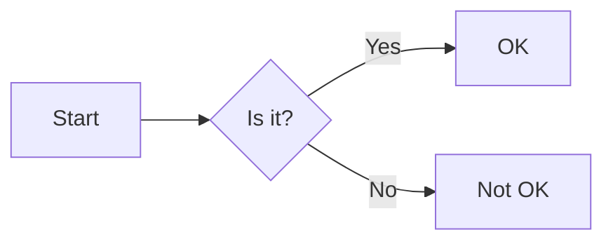

<table>
  <tr>
    <th>Header 1</th>
    <th>Header 2</th>
  </tr>
  <tr>
    <td>Row 1, Cell 1</td>
    <td>Row 1, Cell 2</td>
  </tr>
  <tr>
    <td>Row 2, Cell 1</td>
    <td>Row 2, Cell 2</td>
  </tr>
</table>

##For documentation that may be converted to PDF, you might include page breaks.

### My Custom Heading {#custom-id}

[Link to custom heading](#custom-id)

This text is blue.

  <h3>Heading inside a div</h3>
  
This is a paragraph inside a div.

<!-- This is a comment and will not appear in the rendered output -->

This is the first line.  
This is the second line.

##To create a line break, end a line with two or more spaces, then type return.

